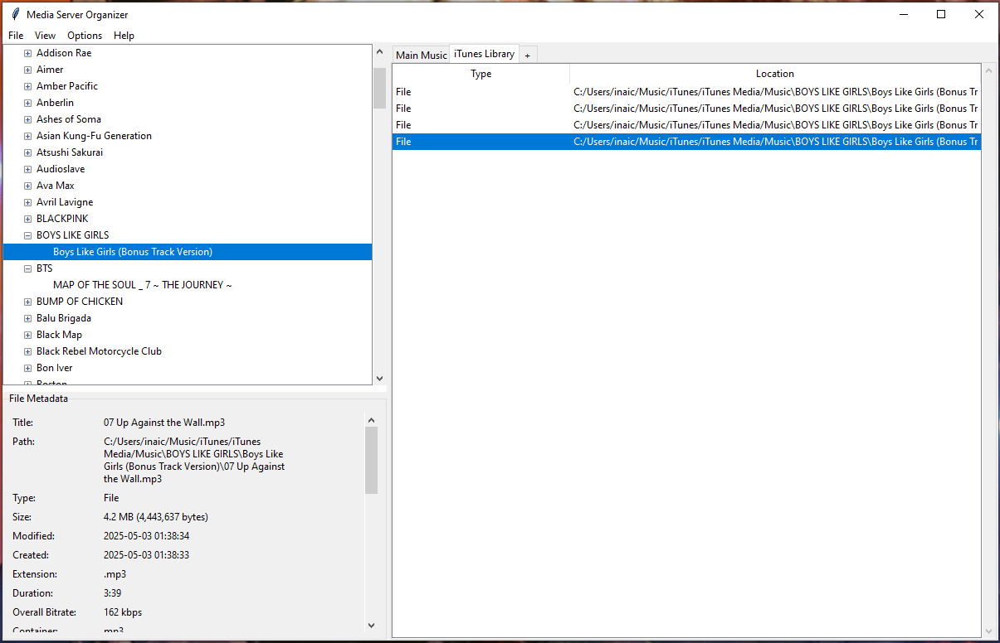

# Media Server Organizer

Media Server Organizer is a desktop GUI for organizing the files and folders of a media server (music, videos, books, comics). It keeps common chores in one place while staying predictable and conservative about what it changes.



## Current version
- **Library management UI** with a local SQLite database for storing libraries.
- **Local + remote libraries** (remote entries stored via SSH host/user details).
- **Tabbed library view** with browsing for folders/files inside the selected library.
- **Folder tree sidebar** for local libraries, with expand/collapse and navigation on double-click.
- **Metadata panel** that surfaces basic file details and media info (via `ffprobe` when available).
- **Theme editor** to customize UI colors and save theme presets.
- **CLI options** for database location and headless mode (`--db`, `--nogui`).
- **Workflows dialog** is present, but workflow execution is not implemented yet.

## Goals
- Organize files into existing, user-defined folder layouts without forcing a new structure.
- Make changes explicit with previews, logs, and reversible steps where possible.
- Keep workflows simple: select sources, review proposals, apply.
- Support mixed libraries (music, video, books, comics) without trying to be an all-in-one media manager.

## Getting started
```bash
python src/media_server_manager.py
```

### CLI options
```bash
python src/media_server_manager.py --db /path/to/media.db
python src/media_server_manager.py --nogui
```

## Next ideas
- Guided organize flow with preview + apply steps.
- Library profiles (base paths, folder patterns, allowed extensions).
- Dry-run + undo history for recent operations.
- Cleanup tools (empty folder removal, stray file detection, duplicate audits).
- Batch rename helpers for common naming patterns.
- Import staging area for reviewing new drops.
