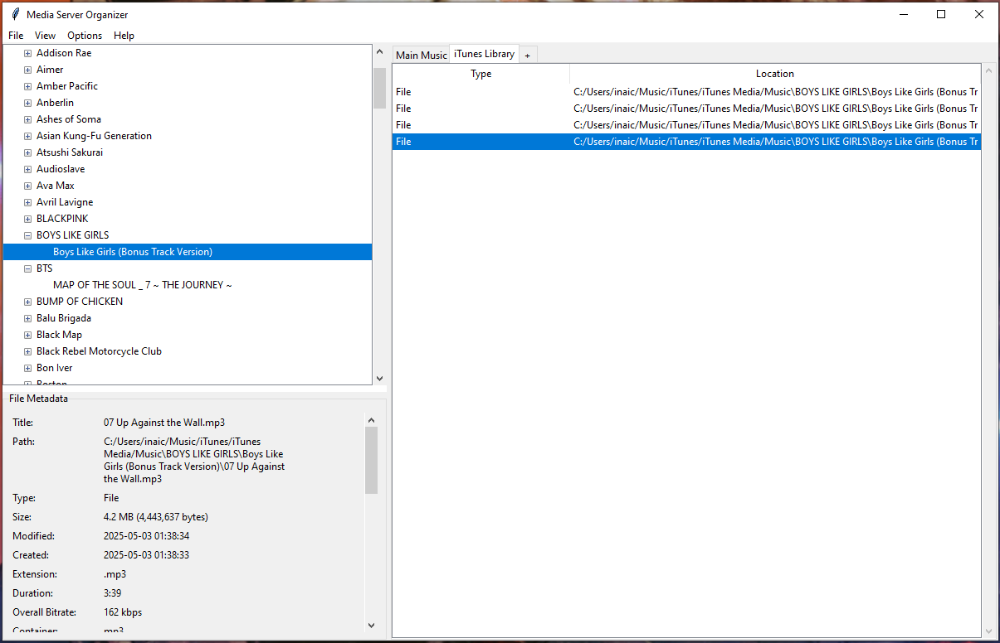

# Media Server Organizer

Media Server Organizer is a desktop application for organizing media files across libraries. It uses a workflow-driven approach to mass-change operations, that includes automatically generating rollback scripts to undo any changes made, even during 'destructive' operations like de-duplication. Libraries can be local folders, or remote locations accessible via SSH (via password or PKI-based auth).



## Current capabilities
- **Library management UI** with a local SQLite database for storing libraries.
- **Local + remote libraries** (remote entries stored via SSH host/user details).
- **Tabbed library view** with browsing for folders/files inside the selected library, including "Up" navigation back toward the library root.
- **Folder tree sidebar** for local libraries, with expand/collapse and navigation on double-click.
- **Metadata panel** that surfaces basic file details and media info (via `ffprobe` when available).
- **Theme editor** to customize UI colors and save theme presets to disk so they survive restarts.
- **Built-in playback** with audio controls (play/pause/stop, progress, volume) and video launchers from the library or folder tree.
- **Playlists pane** with create/rename/delete and add-to-playlist context menus.
- **Workflow dialog** with runnable workflows (library merge, library cleaner, and library dedup) that collect options, preview planned moves, and write rollback scripts and logs after applying changes.
- **Bulk tag editing** from the library and search views (requires `ffmpeg`/`ffprobe`), with rollback scripts that restore the original files.
- **Watch mode** that monitors library folders (event-based via `watchdog` when installed, polling otherwise) and runs the cleaner/dedup workflows on new files.
- **Library index export** to CSV or JSON via Options > Export.
- **Headless CLI** for listing libraries and running workflows without the GUI.

## Getting started
```bash
python src/media_server_manager.py
```

### CLI options
```bash
python src/media_server_manager.py --db /path/to/media.db
python src/media_server_manager.py --nogui
python src/media_server_manager.py --audio-backend sounddevice
python src/media_server_manager.py --log-level DEBUG
```

### Headless workflows
List configured libraries:
```bash
python src/media_server_manager.py --list-libraries
```

Preview a workflow plan (no changes made):
```bash
python src/media_server_manager.py --run-workflow library_cleaner \
    --workflow-options options.json
```

Apply it once the plan looks right:
```bash
python src/media_server_manager.py --run-workflow library_cleaner \
    --workflow-options options.json --workflow-action apply
```

`options.json` is a JSON object of option overrides; any option omitted falls back to the workflow's default, e.g.:
```json
{"library_path": "~/Music", "use_ffprobe": "auto"}
```

## Running tests
```bash
python -m pytest tests/ -q
```
